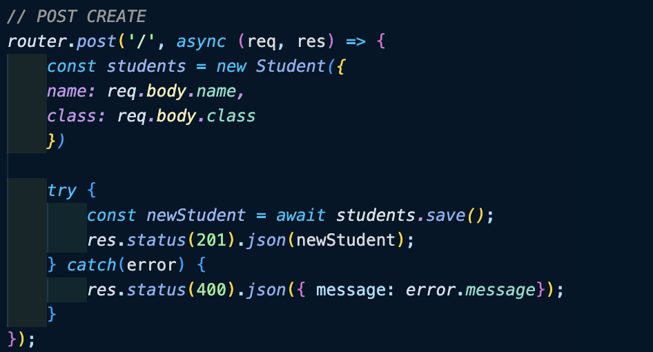

I have just completed a walkthrough for creating a simple CRUD API website and deploying in on Heroku.<!--more--> It was not all that complicated but it did take me longer than I expected due to a simple mistake I made several times. I kept using 'student' instead of 'students'. This messed up many of my routes and I had to comb through my code to find where it needed the change. It is also important to remember which items you should leave as singular such as models and functions.

 I think the most important thing to focus on before you focus on content or styling of your page is that the routes are correct and they do indeed function as expected. I am going to try to remember this when creating on my own. It is hard for me to leave things unfinished but when it comes to coding, I think it would be most beneficial to allow myself to just throw in some placeholder code and check routes and functionality before fully coding my pages. It is much easier to find and fix mistakes where there is less code to look at. 